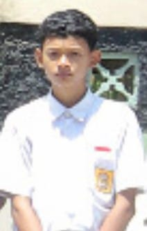

<!DOCTYPE html>
<html lang="id">
<head>
<meta charset="UTF-8">
<meta name="viewport" content="width=device-width, initial-scale=1.0">
<title>Biodata Irfan</title>

</head>
<body>

    

        

        <h1>Irfan Dwi Ariyanto</h1>
        
Student | RPL Developer

        

            Saya adalah seorang siswa kelas 11 RPL 2 dari sekolah SMK N 1 Sanden.
            Saya memiliki minat di bidang pengembangan web dan terus belajar meningkatkan kemampuan di bidang teknologi.
        

        

            
Tempat: Bantul

            
Tanggal Lahir: 20 Januari 2009

            
Email: pppp@mbohhhh.com

            
No HP: +62 812-2872-9455

        

    

    

        <h2>Pendidikan</h2>
        <ul>
            <li>SD Kalidadap 1 (2015 - 2021)</li>
            <li>SMP N 2 Pundong (2021 - 2024)</li>
            <li>SMK N 1 Sanden - RPL (2024 - 2027)</li>
        </ul>
    

    

        <h2>Keahlian</h2>
        

            HTML
            CSS
            JavaScript
            PHP
            Laravel
            NodeJS
        

    

</body>
</html>
